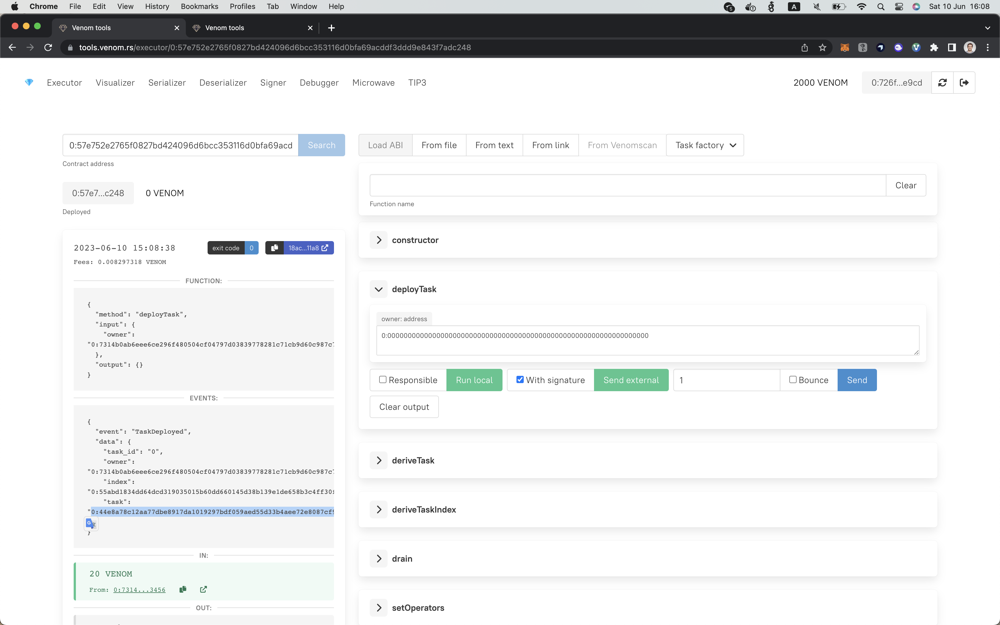
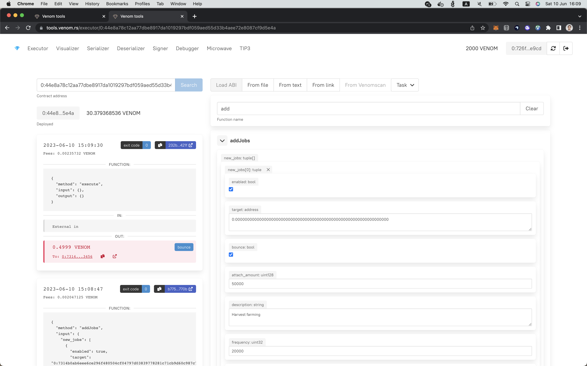
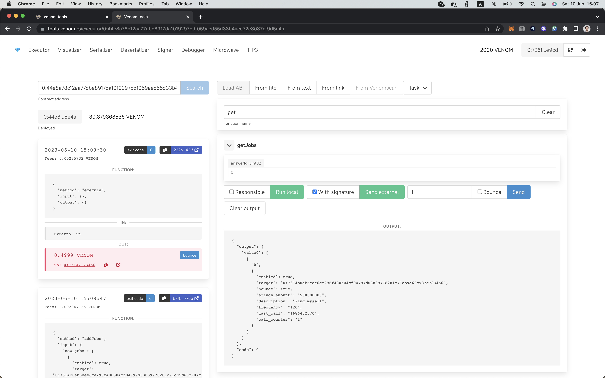
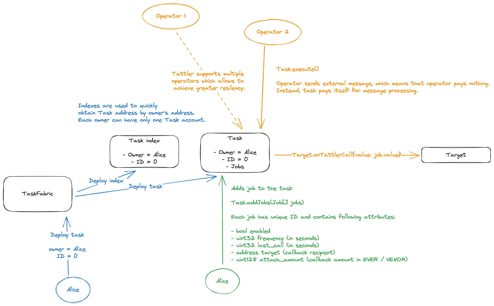

# Tattler

Alarm-clock service for Venom network. Allows developers to delegate regular execution task.

```
Tattler

1. a person who tattles; gossip
2. any of several sandpipers of the genus Heteroscelus, such as H. incanus ( Polynesian tattler), of Pacific coastal regions
```

Any modern blockchain network has at least one service for periodical task execution:

- Keep3r network
- Oraclize
- Ethereum Alarm clock

These services allow developers to expect regular calls execution in smart contracts. For example, Yearn uses Keep3r network to regularly re-balance their strategies.

## Contract addresses

- Venom devnet (https://devnet.venomscan.com/)
  - Task factory: 0:57e752e2765f0827bd424096d6bcc353116d0bfa69acddf3ddd9e843f7adc248

## Create task

To create task use [https://tools.venom.rs](https://tools.venom.rs).

### 1. Use Task Factory to create Task



Remember the `task` field from the `TaskDeployed` event. It's your personal Task contract.

### 2. Add job to the task



### 3. Check the jobs



## Architecture

Architecture is highly scalable and designed specifically for VENOM network architecture (eg scaling, storage fees).



Each Task contract stores up to 20 jobs (due to the storage-fee reasons).

## Docs

Any person can create his own [Task contract](./contracts/Task.tsol), which will store the list of jobs to execute.
Each job contains the following attributes:

```solidity
struct Job {
    bool enabled; // Job can be disabled
    address target; // Target contract, supports the periodical callback
    bool bounce; // Message flag - enabled or disabled bounce. Allows to return VENOM back to Task, in case callback failed
    uint128 attach_amount; // How many VENOMs to attach to each call
    string description; // eg "Harvest my farming"
    uint32 frequency; // How often Tattler should send callbacks
    uint32 last_call; // When the last callback was sent
    uint32 call_counter; // How many callbacks were sent
}
```

## Future plans

- Web interface
- External operators

## FAQ

- What should I do to keep my Task working?

Replenish your Task's balance regularly

## Local installation

```
npm install
```

To set up local version of contracts, use the following command.

```bash
bash-3.2$ npx locklift run --script scripts/1-setup.ts --network local
[INFO]  Found 7 sources
[INFO]  factorySource generated
[INFO]  Built
[INFO]  GiverV2 is used as a giver, the giver balance is: 4998991866.133638648 ever
✔ Factory owner … 0:0000000000000000000000000000000000000000000000000000000000000000
✔ Setup example task … off / on
TaskFactory: 0:6f3b0569662f9cddb212364e0ba98842bb2d6339b0d9dde1496b6443baadb756
Setting up example task
Test user: 0:b9108dcc3fc0f56b5d47d8ae96abc84a6a9a91417175b11dd267e820d7a488e4
Task: 0:9249e7062b75e82e91849c5781eef4627c57994a86ee2f368ae70c4406ee9091
Job added: 6b818339a2467d91bae1ec9d666bed117cdbaff9bdd04aa6164ee0b8d34bebb1
```

Use [evernode-se](https://github.com/tonlabs/evernode-se) to set up local node.

### Running worker

Worker inspects all existing Tasks and trigger execution, if necessary.

```bash
bash-3.2$ TASK_FACTORY=0:.... npx locklift run --script scripts/2-worker.ts --network venom_devnet
```
